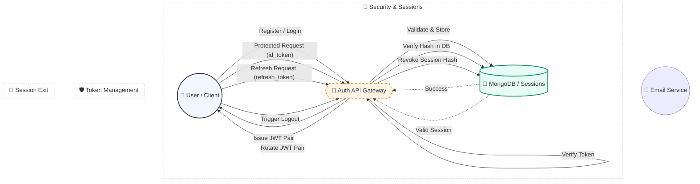

# 🔐 JWT-Auth: The Ultimate Security Gateway


> A high-performance, battle-hardened authentication engine built for the modern web. Secure, scalable, and developer-friendly.

---

## ⚡ Quick Look

`jwt-auth` isn't just another login script. It's a complete **Authentication-as-a-Service** foundation. We've combined the power of **Express 5** with **JWT rotation** and **OAuth2-powered email verification** to give you a security layer that's both invisible to users and impenetrable to attackers.

### 🚀 Core Superpowers
- 🛡️ **Double-Token Defense**: Access Tokens (short-lived) + Refresh Tokens (long-lived).
- 🔄 **Safe Refresh Rotation**: Every refresh generates a new pair, instantly invalidating the old path.
- 📧 **OAuth2 OTP**: Verification codes sent via Gmail's secure OAuth2 layer—no "less secure apps" needed.
- 💻 **Session Intelligence**: Track and revoke specific sessions; kill all malicious logins with one click.
- 🍪 **Hardened Cookies**: `httpOnly`, `secure`, and `SameSite: Strict` by default.

---

## 🛠️ The Tech Stack

| Component | Technology |
| :--- | :--- |
| **Runtime** | Node.js (v18+) |
| **Framework** | Express 5 |
| **Database** | MongoDB (via Mongoose) |
| **Security** | JSON Web Tokens |
| **Mail Engine** | Nodemailer (OAuth2 Strategy) |
| **Logging** | Morgan & Dev-Logging |

---



---

## 🚀 Get Started in 60 Seconds

### 1. Setup Environment
```bash
cp .env.example .env
```
Fill your `.env` with your MongoDB URI and Google OAuth2 secrets.

### 2. Launch
```bash
npm install
npm run dev
```

---

## 📡 The API Blueprint

### Authentication
- `POST /api/auth/register` — Create your account and trigger OTP
- `POST /api/auth/verify-email` — Confirm your identity with the 6-digit code
- `POST /api/auth/login` — Enter the gateway and receive your tokens

### Identity & Sessions
- `GET /api/auth/get-me` — Retrieve your profile (requires Bearer token)
- `GET /api/auth/refresh-token` — Silent refresh with cookie-based security
- `POST /api/auth/logout` — Securely end your current session
- `GET /api/auth/logout-all` — The "Panic Button": Log out from every device

---

## 🛡️ Best Practices Implemented
- **Password Transparency**: We never store plain text. All passwords are SHA-256 hashed.
- **CSRF Protection**: Refresh tokens are locked to `httpOnly` cookies, unreachable by JS.
- **Memory Efficiency**: Minimal footprint using Express 5's improved routing.
- **Environment Safety**: Critical secrets are strictly managed and validated on startup.

---

## 🤝 Contributing
Got an idea? Open a PR! Let's make `jwt-auth` the gold standard for Node.js security.

---

### 📜 License
Released under the **ISC License**. Built with ❤️ by [GitEPatiL](https://github.com/GitEPatiL).
